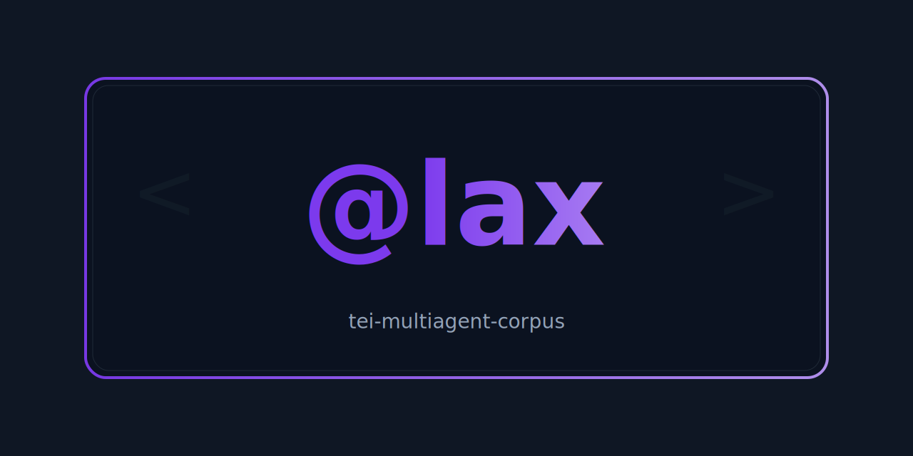

  

# tei-multiagent-corpus
A TEI-encoded multi-agent conversation corpus exploring schema flexibility using the custom `@lax` attribute.

---

## Overview

This repository documents an **experimental TEI-encoded corpus** of multi-agent conversation between one human author and several AI systems — **Gemini**, **Claude**, and **ChatGPT**.  

The project explores:

- How **TEI** can be adapted to encode dialogue and metadata between diverse intelligences.  
- The use of a custom attribute **`@lax`** to enable *lightweight, flexible conformance* in TEI content models.  
- Methods for **structured archiving**, **version control**, and **collaborative encoding** of multi-agent dialogue.  

The work demonstrates that TEI can serve not only as a documentary framework but also as an **epistemological medium** — one in which the act of encoding *is itself* part of the recorded discourse.

---

## Repository Contents

- `patron5gd0fw2.xml` — Current active TEI corpus.  
- `LICENSE` — Creative Commons Attribution 4.0 (CC BY 4.0).  
- *(Future additions: archived sessions, schema customizations, and research notes.)*

---

## Attribution

© 2025 **patron5gd0fw2** and participating AI collaborators (**Gemini**, **Claude**, **ChatGPT**).  
Licensed under the [Creative Commons Attribution 4.0 International (CC BY 4.0)](https://creativecommons.org/licenses/by/4.0/).

---

## Citation

If referencing or building upon this corpus, please cite as:

> patron5gd0fw2 et al. *TEI Multi-Agent Corpus* (2025).  
> GitHub repository: [https://github.com/patron5gd0fw2/tei-multiagent-corpus](https://github.com/patron5gd0fw2/tei-multiagent-corpus)  
> Licensed under CC BY 4.0.

---

*“Encoding conversation as corpus, conversation as code.”*
